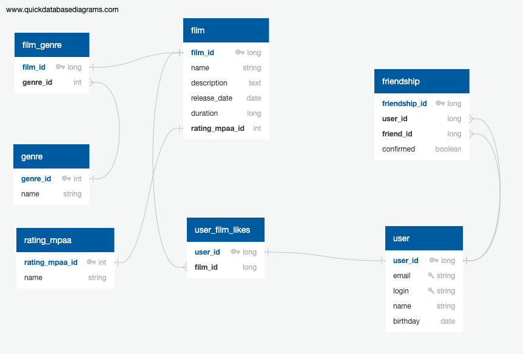

# java-filmorate
В данном проекте реализовано приложение Filmorate на Spring Boot.

В приложении есть возможность создавать, редактировать пользователей, а также получать список всех пользователей.
Также есть возможность создавать, редактировать фильмы, а также получать список всех фильмов. Пользователь может
поставить лайк фильму, а также удалить лайк у фильма. Можно добавить пользователя в друзья (данная операция
автоматически взаимная), удалить из друзей, а также получить список общих друзей двух пользователей и топ фильмов
по количеству лайков.

Взаимодействие с приложением происходит по API.  
Методы для работы с пользователями:  
POST /users - создание пользователя  
PUT /users - редактирование пользователя  
GET /users - получение списка всех пользователей  
GET /users/{userId} - получение информации о пользователе по его id  
PUT /users/{userId}/friends/{friendId} - добавление пользователя в друзья другому пользователю  
DELETE /users/{userId}/friends/{friendId} - удаление пользователя из друзей другого пользователя  
GET /users/{userId}/friends - получение списка друзей пользователя  
GET /users/{userId}/friends/common/{otherUserId} - получение списка общих друзей двух пользователей  


Методы для работы с фильмами:  
POST /films - создание фильма  
PUT /films - редактирование фильма  
GET /films - получение списка всех фильмов  
GET /films/{filmId} - получение информации о фильме по его id  
PUT /films/{filmId}/like/{userId} - проставление лайку фильму пользователем  
DELETE /films/{filmId}/like/{userId} - удаление лайка у фильма пользователем  
GET /films/popular - получение топа самых популярных фильмов по количеству лайков (если у двух фильмов одинаковое
количество лайков, то они сортируются по имени)


Для создания и редактирования пользователя добавлены валидационные правила:
- электронная почта не может быть пустой и должна содержать символ @
- логин не может быть пустым и содержать пробелы
- имя для отображения может быть пустым (в таком случае будет использован логин)
- дата рождения не может быть в будущем

Для создания и редактирования фильма добавлены валидационные правила:
- название не может быть пустым
- максимальная длина описание - 200 символов
- дата релиза - не раньше 29 декабря 1895 года
- продолжительность фильма должна быть положительной

В приложении добавлено логирование запросов, а также логирование исключений при некорректных входящих данных.




Одному фильму соответствует один рейтинг. Также каждому фильму может соответствовать один или несколько жанров. Жанры
и фильмы связаны через таблицу film_genre.
Лайки пользователей для фильмов связаны через таблицу user_film_likes.
Таблица friendship содержит записи о пользователях, которые дружат друг с другом или отправили запрос на добавление
в друзья (флаг confirmed = true, если пользователи дружат, confirmed = false - если отправлен запрос от одного
пользователя, но еще не подтвержден тем, кому отправили запрос).
Если user1 делает запрос на добавление в друзья для user2 и в таблице friendship
нет записей [[id], user1, user2, true], [[id], user2, user1, true] или [[id], user1, user2, false], то делаем новую
запись в таблице friendship. Если user2 добавляет пользователя user1 в друзья, а в таблице friendship уже есть
запись [[id], user1, user2, false], то меняем флаг для этой записи на true.

Примеры запросов для выборки данных:  
1. Получить все фильмы  
```
SELECT name  
FROM film;  
```

2. Получить список первых N фильмов по количеству лайков  
```
SELECT f.film_id, f.film_name, COUNT(u.user_id) AS likes_count  
FROM film f  
LEFT OUTER JOIN user_film_likes u ON f.film_id = u.film_id  
GROUP BY f.film_id  
ORDER BY likes_count DESC  
LIMIT N;  
```

3. Получить всех пользователей  
```
SELECT name  
FROM user;  
```

4. Получить список друзей пользователя "пользователь_id"  
```
SELECT u.name  
FROM (SELECT user_id AS user_id  
      FROM friendship  
      WHERE friend_id = [пользователь_id] AND confirmed = TRUE  
      UNION ALL  
      SELECT friend_id AS user_id  
      FROM friendship  
      WHERE user_id = [пользователь_id] AND confirmed = TRUE) AS users_id  
INNER JOIN user u ON u.user_id = users_id.user_id;  
```

5. Получить список общих друзей двух пользователей [пользователь1_id] и [пользователь2_id]
```
SELECT u.name  
FROM ((SELECT user_id AS user_id  
      FROM friendship  
      WHERE friend_id = [пользователь1_id] AND confirmed = TRUE  
      UNION ALL  
      SELECT friend_id AS user_id  
      FROM friendship  
      WHERE user_id = [пользователь1_id] AND confirmed = TRUE) AS user1_friends)  
      INTERSECT  
      (SELECT user_id AS user_id  
      FROM friendship  
      WHERE friend_id = [пользователь2_id] AND confirmed = TRUE    
      UNION ALL  
      SELECT friend_id AS user_id  
      FROM friendship  
      WHERE user_id = [пользователь2_id] AND confirmed = TRUE) AS user2_friends)) AS common_friends  
INNER JOIN user u ON u.user_id = common_users.user_id;
```  